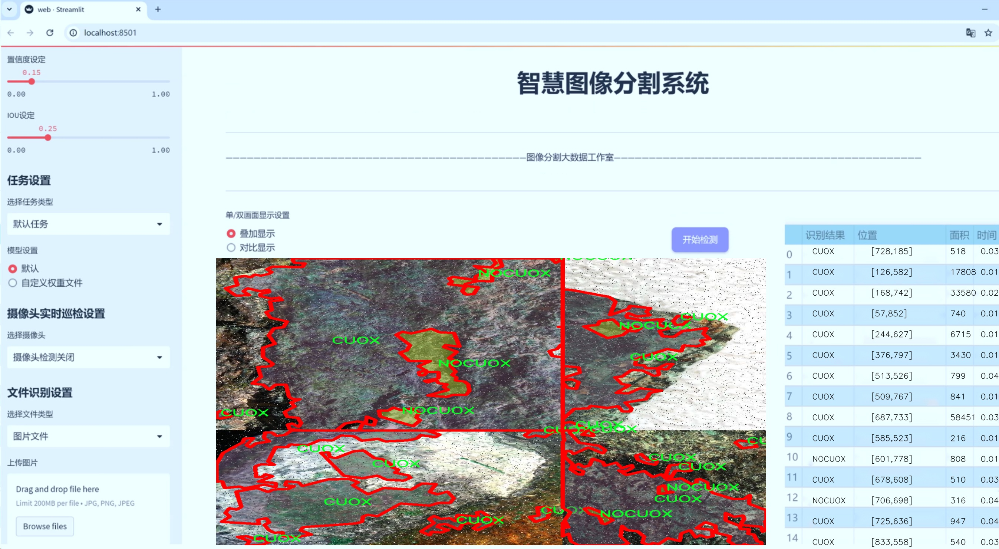
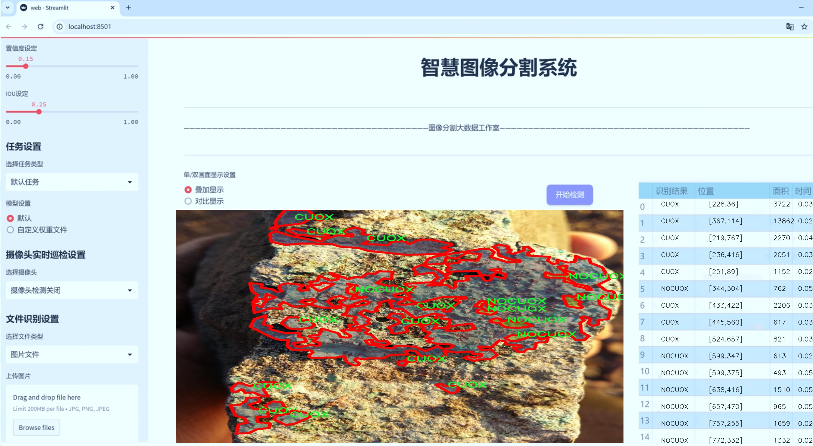
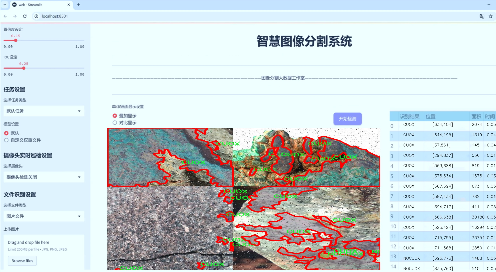
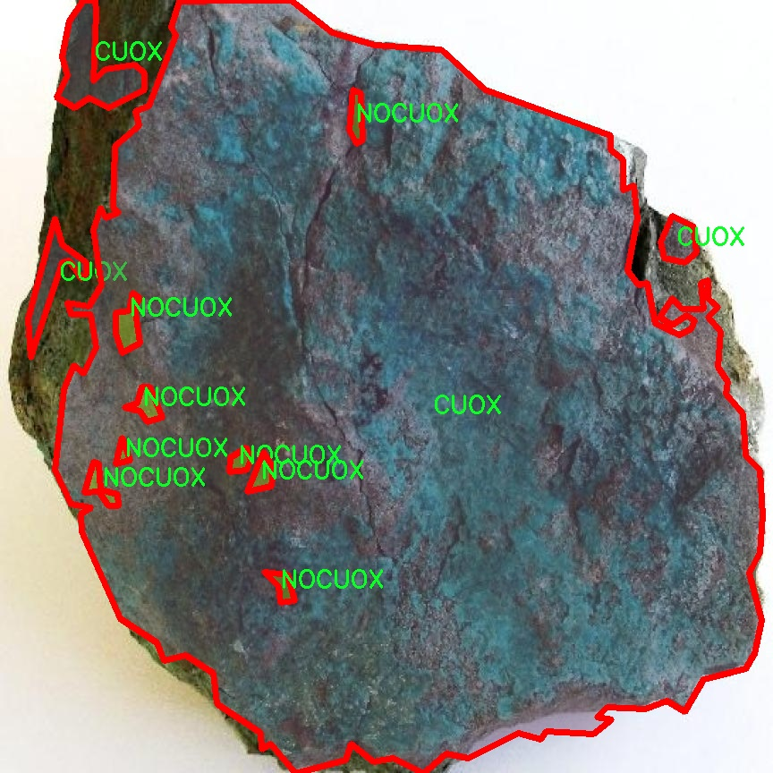
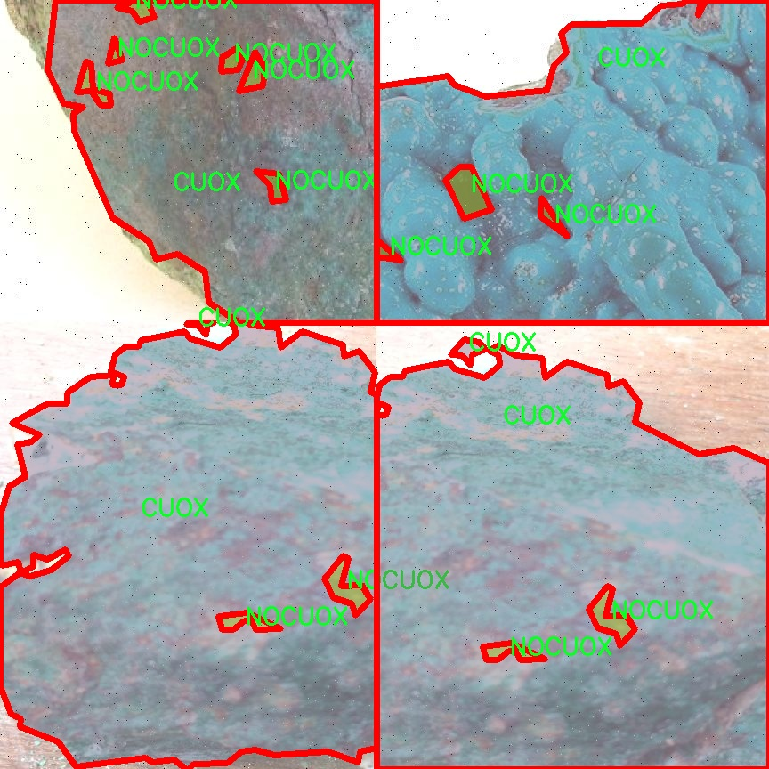
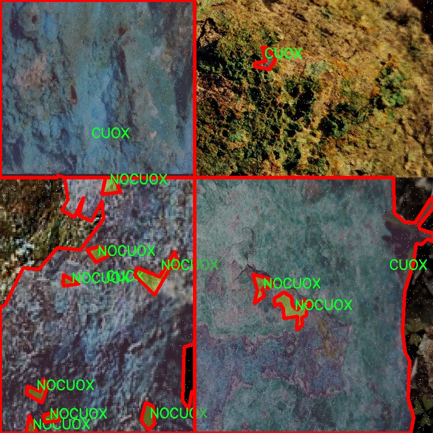
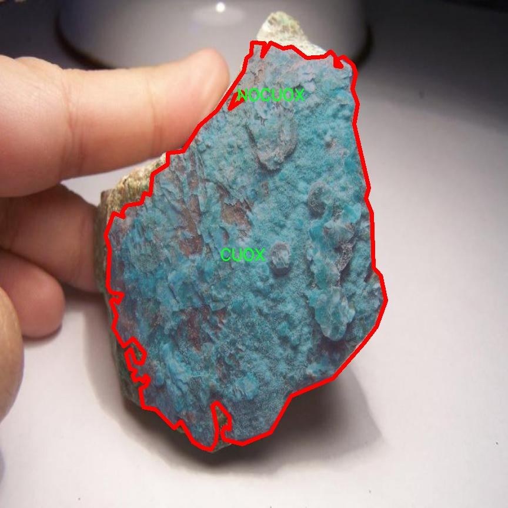
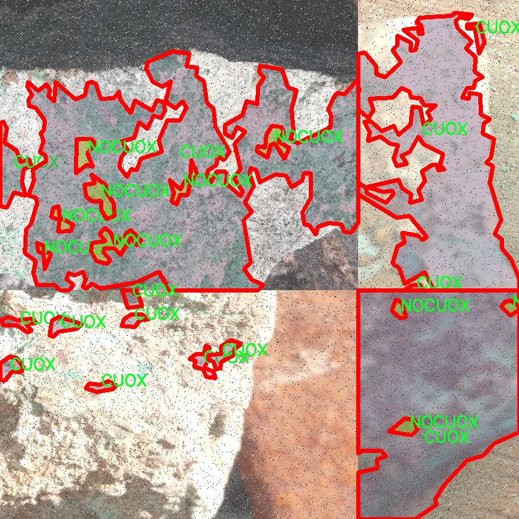

# 矿物图像分割系统： yolov8-seg-SPDConv

### 1.研究背景与意义

[参考博客](https://gitee.com/YOLOv8_YOLOv11_Segmentation_Studio/projects)

[博客来源](https://kdocs.cn/l/cszuIiCKVNis)

研究背景与意义

随着全球矿业行业的不断发展，矿物资源的勘探与开采面临着越来越大的挑战。传统的矿物识别和分类方法往往依赖于人工经验，效率低下且易受主观因素影响。近年来，计算机视觉技术的迅猛发展为矿物图像处理提供了新的解决方案。尤其是深度学习技术的应用，使得图像分割和物体检测在矿物识别领域展现出巨大的潜力。YOLO（You Only Look Once）系列模型作为一种高效的目标检测算法，因其快速的处理速度和较高的准确率而受到广泛关注。特别是YOLOv8的推出，进一步提升了目标检测的性能，为矿物图像的精确分割提供了可能。

在矿物图像分割的研究中，数据集的构建是至关重要的一环。本研究所使用的“mineralesALL”数据集包含1200幅图像，涵盖了两类矿物：CUOX和NOCUOX。这一数据集的多样性和丰富性为模型的训练和测试提供了坚实的基础。通过对这两类矿物的图像进行实例分割，可以有效提高矿物识别的准确性，进而推动矿业资源的高效利用和可持续发展。

矿物图像分割系统的研究意义不仅体现在技术层面，更在于其对矿业行业的深远影响。首先，改进YOLOv8的矿物图像分割系统能够显著提高矿物识别的效率和准确性，减少人工干预，从而降低人力成本。其次，精准的矿物识别和分类能够为矿业企业提供更为可靠的数据支持，帮助其在资源勘探和开采过程中做出更为科学的决策。此外，该系统的应用还可以促进矿物资源的合理开发，降低环境影响，推动矿业的可持续发展。

从学术研究的角度来看，基于改进YOLOv8的矿物图像分割系统不仅丰富了计算机视觉和深度学习领域的研究内容，也为矿物识别的相关研究提供了新的思路和方法。通过对YOLOv8模型的改进，研究者可以探索更为高效的特征提取和分割算法，为后续的研究奠定基础。同时，针对矿物图像的特性进行模型优化，能够推动图像处理技术在其他领域的应用，形成良好的学术交流与合作。

综上所述，基于改进YOLOv8的矿物图像分割系统的研究具有重要的理论价值和实践意义。它不仅为矿业行业提供了先进的技术支持，也为相关学术研究开辟了新的方向。通过深入探讨矿物图像分割的技术细节与应用场景，本研究将为推动矿业智能化、数字化转型贡献力量。

### 2.图片演示







注意：本项目提供完整的训练源码数据集和训练教程,由于此博客编辑较早,暂不提供权重文件（best.pt）,需要按照6.训练教程进行训练后实现上图效果。

### 3.视频演示

[3.1 视频演示](https://www.bilibili.com/video/BV1nMzzYEE2P/)

### 4.数据集信息

##### 4.1 数据集类别数＆类别名

train: ../train/images
val: ../valid/images
test: ../test/images

nc: 2
names: ['CUOX', 'NOCUOX']

roboflow:
  workspace: mineralizadosyolov3old
  project: mineralesall
  version: 1
  license: CC BY 4.0
  url: https://universe.roboflow.com/mineralizadosyolov3old/mineralesall/dataset/1

##### 4.2 数据集信息简介

数据集信息展示

在本研究中，我们采用了名为“mineralesALL”的数据集，以训练和改进YOLOv8-seg的矿物图像分割系统。该数据集专注于矿物图像的分类与分割，特别是针对两种矿物类别的识别与处理。这两种类别分别为CUOX和NOCUOX，涵盖了矿物图像分析中的重要特征。通过精确的图像分割技术，我们希望能够提升矿物分类的准确性，从而为矿物资源的开发与利用提供更为可靠的数据支持。

数据集的结构分为三个主要部分：训练集、验证集和测试集。训练集位于“../train/images”目录下，包含了大量标注的矿物图像，这些图像为模型的学习提供了基础数据。验证集存放在“../valid/images”目录中，主要用于在训练过程中评估模型的性能，确保模型在未见数据上的泛化能力。测试集则位于“../test/images”目录，旨在对最终模型的效果进行全面评估，以检验其在实际应用中的表现。

在类别数量方面，该数据集包含两个主要类别，分别是CUOX和NOCUOX。这两个类别的选择不仅反映了矿物图像分割的复杂性，也突显了不同矿物特征的多样性。CUOX代表了一类特定的矿物，可能具有独特的光谱特征和形态特征，而NOCUOX则可能代表另一类矿物，二者的分割与识别对于矿物学研究和资源开发具有重要意义。

此外，该数据集的使用遵循CC BY 4.0许可证，允许用户在遵循相应的引用和署名要求下，进行修改和再分发。这种开放的许可协议促进了学术界和工业界的合作与创新，使得研究人员能够在此基础上进行更深入的研究和应用开发。

通过使用“mineralesALL”数据集，我们期望能够推动矿物图像分割技术的发展，尤其是在YOLOv8-seg模型的应用中。该模型以其高效的特征提取能力和实时处理能力，能够在复杂的矿物图像中实现精准的分割，进而提升矿物识别的效率和准确性。随着数据集的不断扩展和模型的持续优化，我们相信这一研究将为矿物资源的智能化管理和开发提供新的思路和方法。

总之，“mineralesALL”数据集不仅为矿物图像分割提供了丰富的样本和标注信息，也为后续的研究提供了坚实的基础。通过对该数据集的深入分析与应用，我们希望能够为矿物学领域带来新的突破，并为相关行业的技术进步贡献力量。











### 5.项目依赖环境部署教程（零基础手把手教学）

[5.1 环境部署教程链接（零基础手把手教学）](https://www.bilibili.com/video/BV1jG4Ve4E9t/?vd_source=bc9aec86d164b67a7004b996143742dc)


[5.2 安装Python虚拟环境创建和依赖库安装视频教程链接（零基础手把手教学）](https://www.bilibili.com/video/BV1nA4VeYEze/?vd_source=bc9aec86d164b67a7004b996143742dc)

### 6.手把手YOLOV8-seg训练视频教程（零基础手把手教学）

[6.1 手把手YOLOV8-seg训练视频教程（零基础小白有手就能学会）](https://www.bilibili.com/video/BV1cA4VeYETe/?vd_source=bc9aec86d164b67a7004b996143742dc)


按照上面的训练视频教程链接加载项目提供的数据集，运行train.py即可开始训练



     Epoch   gpu_mem       box       obj       cls    labels  img_size
     1/200     0G   0.01576   0.01955  0.007536        22      1280: 100%|██████████| 849/849 [14:42<00:00,  1.04s/it]
               Class     Images     Labels          P          R     mAP@.5 mAP@.5:.95: 100%|██████████| 213/213 [01:14<00:00,  2.87it/s]
                 all       3395      17314      0.994      0.957      0.0957      0.0843

     Epoch   gpu_mem       box       obj       cls    labels  img_size
     2/200     0G   0.01578   0.01923  0.007006        22      1280: 100%|██████████| 849/849 [14:44<00:00,  1.04s/it]
               Class     Images     Labels          P          R     mAP@.5 mAP@.5:.95: 100%|██████████| 213/213 [01:12<00:00,  2.95it/s]
                 all       3395      17314      0.996      0.956      0.0957      0.0845

     Epoch   gpu_mem       box       obj       cls    labels  img_size
     3/200     0G   0.01561    0.0191  0.006895        27      1280: 100%|██████████| 849/849 [10:56<00:00,  1.29it/s]
               Class     Images     Labels          P          R     mAP@.5 mAP@.5:.95: 100%|███████   | 187/213 [00:52<00:00,  4.04it/s]
                 all       3395      17314      0.996      0.957      0.0957      0.0845


### 7.50+种全套YOLOV8-seg创新点加载调参实验视频教程（一键加载写好的改进模型的配置文件）

[7.1 50+种全套YOLOV8-seg创新点加载调参实验视频教程（一键加载写好的改进模型的配置文件）](https://www.bilibili.com/video/BV1Hw4VePEXv/?vd_source=bc9aec86d164b67a7004b996143742dc)

### YOLOV8-seg算法简介

原始YOLOv8-seg算法原理

YOLOv8-seg算法是Ultralytics在2023年发布的YOLO系列的最新版本，它在目标检测和图像分割领域中展现出了卓越的性能。作为YOLO系列的延续，YOLOv8-seg不仅吸收了前几代算法的优点，还在多个方面进行了创新和优化，使其在实时检测和分割任务中达到了新的高度。

YOLOv8-seg的核心理念是将目标检测与图像分割有效结合，通过深度学习技术实现对物体的精确定位和分割。该算法的设计基于卷积神经网络（CNN），采用了全新的网络结构和训练策略，旨在提高检测精度和速度。YOLOv8-seg的输入图像尺寸默认为640x640像素，但其独特的自适应图像缩放技术允许在不同长宽比的图像上进行有效的处理。这种处理方式通过将长边按比例缩小到指定尺寸，并对短边进行填充，最大限度地减少了信息冗余，从而提升了目标检测和推理的速度。

在网络结构方面，YOLOv8-seg引入了C2F模块，替代了YOLOv5中的C3模块。C2F模块的设计灵感来源于YOLOv7中的ELAN模块，它通过并行化更多的梯度流分支，确保了在轻量化的同时能够获得更丰富的特征信息。这种结构的优化不仅提高了模型的精度，还有效降低了延迟，使得YOLOv8-seg在实时应用中表现得更加出色。

YOLOv8-seg的Neck部分同样进行了重要的改进。与YOLOv5相比，YOLOv8的Neck去除了两次上采样之前的1x1卷积连接层，直接对Backbone不同阶段输出的特征进行上采样。这一变化使得特征融合更加高效，进一步提升了模型的性能。

在Head部分，YOLOv8-seg实现了从Coupled-Head（耦合头）到Decoupled-Head（解耦头）的转变。这一结构的变化使得检测和分类的卷积过程相互独立，分别处理不同的任务。通过引入两个1x1卷积模块，YOLOv8-seg能够更精确地进行类别预测和边界框回归，优化了损失函数的设计。特别是，YOLOv8-seg取消了Obj分支，采用BCELoss和DFL+CIoULoss的组合，使得模型在训练过程中能够更快地聚焦于标签附近的数值，从而提高了检测的准确性。

YOLOv8-seg的另一大创新在于其Anchor-Free的设计理念。传统的Anchor-Based方法依赖于预设的锚框来进行目标检测，而YOLOv8-seg则将目标检测转化为关键点检测，避免了对锚框的依赖。这一变化不仅简化了网络结构，还增强了模型的泛化能力，使其在处理不同类型的目标时表现得更加灵活和高效。

通过这些创新，YOLOv8-seg在多个数据集上的表现均优于前代模型。在COCOval2017数据集上的测试结果显示，YOLOv8-seg在精度和速度上均达到了新的高度，成为目标检测和图像分割领域的佼佼者。这一模型的成功应用，不仅推动了计算机视觉技术的发展，也为各类实际应用场景提供了强有力的技术支持。

在实际应用中，YOLOv8-seg被广泛应用于智能监控、自动驾驶、农业机器人等多个领域。例如，在苹果采摘的场景中，YOLOv8-seg能够快速、准确地识别和定位苹果，为自动采摘机器人提供必要的视觉信息。同时，结合蚁群算法进行路径规划，使得机器人能够高效地完成采摘任务，进一步提升了生产效率。

综上所述，YOLOv8-seg算法通过一系列的结构优化和创新设计，不仅在目标检测和图像分割中展现了卓越的性能，还为未来的研究和应用提供了新的思路和方向。随着技术的不断进步，YOLOv8-seg无疑将在更多领域发挥重要作用，推动智能化进程的加速。


### 9.系统功能展示（检测对象为举例，实际内容以本项目数据集为准）

图9.1.系统支持检测结果表格显示

  图9.2.系统支持置信度和IOU阈值手动调节

  图9.3.系统支持自定义加载权重文件best.pt(需要你通过步骤5中训练获得)

  图9.4.系统支持摄像头实时识别

  图9.5.系统支持图片识别

  图9.6.系统支持视频识别

  图9.7.系统支持识别结果文件自动保存

  图9.8.系统支持Excel导出检测结果数据


### 10.50+种全套YOLOV8-seg创新点原理讲解（非科班也可以轻松写刊发刊，V11版本正在科研待更新）

#### 10.1 由于篇幅限制，每个创新点的具体原理讲解就不一一展开，具体见下列网址中的创新点对应子项目的技术原理博客网址【Blog】：


[10.1 50+种全套YOLOV8-seg创新点原理讲解链接](https://gitee.com/qunmasj/good)

#### 10.2 部分改进模块原理讲解(完整的改进原理见上图和技术博客链接)【如果此小节的图加载失败可以通过CSDN或者Github搜索该博客的标题访问原始博客，原始博客图片显示正常】
### CBAM空间注意力机制
近年来，随着深度学习研究方向的火热，注意力机制也被广泛地应用在图像识别、语音识别和自然语言处理等领域，注意力机制在深度学习任务中发挥着举足轻重的作用。注意力机制借鉴于人类的视觉系统，例如，人眼在看到一幅画面时，会倾向于关注画面中的重要信息，而忽略其他可见的信息。深度学习中的注意力机制和人类视觉的注意力机制相似，通过扫描全局数据，从大量数据中选择出需要重点关注的、对当前任务更为重要的信息，然后对这部分信息分配更多的注意力资源，从这些信息中获取更多所需要的细节信息，而抑制其他无用的信息。而在深度学习中，则具体表现为给感兴趣的区域更高的权重，经过网络的学习和调整，得到最优的权重分配，形成网络模型的注意力，使网络拥有更强的学习能力，加快网络的收敛速度。
注意力机制通常可分为软注意力机制和硬注意力机制[4-5]。软注意力机制在选择信息时，不是从输入的信息中只选择1个，而会用到所有输入信息，只是各个信息对应的权重分配不同，然后输入网络模型进行计算;硬注意力机制则是从输入的信息中随机选取一个或者选择概率最高的信息，但是这一步骤通常是不可微的，导致硬注意力机制更难训练。因此，软注意力机制应用更为广泛，按照原理可将软注意力机制划分为:通道注意力机制（channel attention)、空间注意力机制(spatial attention）和混合域注意力机制(mixed attention)。
通道注意力机制的本质建立各个特征通道之间的重要程度，对感兴趣的通道进行重点关注，弱化不感兴趣的通道的作用;空间注意力的本质则是建模了整个空间信息的重要程度，然后对空间内感兴趣的区域进行重点关注，弱化其余非感兴趣区域的作用;混合注意力同时运用了通道注意力和空间注意力，两部分先后进行或并行，形成对通道特征和空间特征同时关注的注意力模型。

卷积层注意力模块(Convolutional Block Attention Module，CBAM）是比较常用的混合注意力模块，其先后集中了通道注意力模块和空间注意力模块，网络中加入该模块能有效提高网络性能，减少网络模型的计算量，模块结构如图所示。输入特征图首先经过分支的通道注意力模块，然后和主干的原特征图融合，得到具有通道注意力的特征图，接着经过分支的空间注意力模块，在和主干的特征图融合后，得到同时具有通道特征注意力和空间特征注意力的特征图。CBAM模块不改变输入特征图的大小，因此该模块是一个“即插即用”的模块，可以插入网络的任何位置。

通道注意力模块的结构示意图如图所示，通道注意力模块分支并行地对输入的特征图进行最大池化操作和平均池化操作，然后利用多层感知机对结果进行变换，得到应用于两个通道的变换结果，最后经过sigmoid激活函数将变换结果融合，得到具有通道注意力的通道特征图。

空间注意力模块示意图如图所示，将通道注意力模块输出的特征图作为该模块的输入特征图，首先对输入特征图进行基于通道的最大池化操作和平均池化操作，将两部分得到的结果拼接起来，然后通过卷积得到降为Ⅰ通道的特征图，最后通过sigmoid激活函数生成具有空间注意力的特征图。


### 11.项目核心源码讲解（再也不用担心看不懂代码逻辑）

#### 11.1 ultralytics\models\sam\modules\encoders.py

以下是对代码中最核心部分的提炼和详细中文注释。代码主要实现了一个图像编码器，使用了视觉变换器（ViT）架构来将图像编码为紧凑的潜在空间。

```python
import torch
import torch.nn as nn
from typing import Optional, Tuple, Type

class ImageEncoderViT(nn.Module):
    """
    使用视觉变换器（ViT）架构的图像编码器，将图像编码为紧凑的潜在空间。
    编码器将图像分割为补丁，并通过一系列变换块处理这些补丁。
    最终的编码表示通过一个颈部模块生成。
    """

    def __init__(
            self,
            img_size: int = 1024,  # 输入图像的尺寸，假设为正方形
            patch_size: int = 16,   # 补丁的尺寸
            in_chans: int = 3,      # 输入图像的通道数
            embed_dim: int = 768,   # 补丁嵌入的维度
            depth: int = 12,        # ViT的深度
            num_heads: int = 12,    # 每个ViT块中的注意力头数
            out_chans: int = 256,   # 输出通道数
            norm_layer: Type[nn.Module] = nn.LayerNorm,  # 归一化层
            act_layer: Type[nn.Module] = nn.GELU,         # 激活层
    ) -> None:
        """
        初始化图像编码器的参数。
        """
        super().__init__()
        self.img_size = img_size

        # 补丁嵌入模块，将图像分割为补丁并进行嵌入
        self.patch_embed = PatchEmbed(
            kernel_size=(patch_size, patch_size),
            stride=(patch_size, patch_size),
            in_chans=in_chans,
            embed_dim=embed_dim,
        )

        # 创建多个变换块
        self.blocks = nn.ModuleList()
        for _ in range(depth):
            block = Block(
                dim=embed_dim,
                num_heads=num_heads,
                norm_layer=norm_layer,
                act_layer=act_layer,
            )
            self.blocks.append(block)

        # 颈部模块，用于进一步处理输出
        self.neck = nn.Sequential(
            nn.Conv2d(embed_dim, out_chans, kernel_size=1, bias=False),
            nn.LayerNorm(out_chans),
            nn.Conv2d(out_chans, out_chans, kernel_size=3, padding=1, bias=False),
            nn.LayerNorm(out_chans),
        )

    def forward(self, x: torch.Tensor) -> torch.Tensor:
        """
        处理输入，通过补丁嵌入、变换块和颈部模块生成最终的编码表示。
        """
        x = self.patch_embed(x)  # 将输入图像转换为补丁嵌入
        for blk in self.blocks:   # 通过每个变换块
            x = blk(x)
        return self.neck(x.permute(0, 3, 1, 2))  # 调整维度并通过颈部模块


class PatchEmbed(nn.Module):
    """图像到补丁嵌入的转换模块。"""

    def __init__(
            self,
            kernel_size: Tuple[int, int] = (16, 16),
            stride: Tuple[int, int] = (16, 16),
            in_chans: int = 3,
            embed_dim: int = 768,
    ) -> None:
        """
        初始化补丁嵌入模块。
        """
        super().__init__()
        self.proj = nn.Conv2d(in_chans, embed_dim, kernel_size=kernel_size, stride=stride)

    def forward(self, x: torch.Tensor) -> torch.Tensor:
        """计算补丁嵌入，通过卷积操作并调整结果张量的维度。"""
        return self.proj(x).permute(0, 2, 3, 1)  # B C H W -> B H W C


class Block(nn.Module):
    """变换块，支持窗口注意力和残差传播。"""

    def __init__(
        self,
        dim: int,
        num_heads: int,
        norm_layer: Type[nn.Module] = nn.LayerNorm,
        act_layer: Type[nn.Module] = nn.GELU,
    ) -> None:
        """
        初始化变换块的参数。
        """
        super().__init__()
        self.norm1 = norm_layer(dim)  # 第一层归一化
        self.attn = Attention(dim, num_heads=num_heads)  # 注意力机制
        self.norm2 = norm_layer(dim)  # 第二层归一化
        self.mlp = MLPBlock(embedding_dim=dim, mlp_dim=int(dim * 4), act=act_layer)  # MLP模块

    def forward(self, x: torch.Tensor) -> torch.Tensor:
        """执行变换块的前向传播。"""
        shortcut = x
        x = self.norm1(x)  # 归一化
        x = self.attn(x)   # 注意力机制
        x = shortcut + x   # 残差连接
        return x + self.mlp(self.norm2(x))  # 再次归一化并通过MLP


class Attention(nn.Module):
    """多头注意力模块。"""

    def __init__(
        self,
        dim: int,
        num_heads: int = 8,
    ) -> None:
        """
        初始化注意力模块的参数。
        """
        super().__init__()
        self.num_heads = num_heads
        head_dim = dim // num_heads
        self.scale = head_dim ** -0.5  # 缩放因子

        self.qkv = nn.Linear(dim, dim * 3)  # 线性层用于生成q, k, v
        self.proj = nn.Linear(dim, dim)     # 线性层用于输出

    def forward(self, x: torch.Tensor) -> torch.Tensor:
        """执行注意力机制的前向传播。"""
        B, H, W, _ = x.shape
        qkv = self.qkv(x).reshape(B, H * W, 3, self.num_heads, -1).permute(2, 0, 3, 1, 4)  # 生成q, k, v
        q, k, v = qkv.reshape(3, B * self.num_heads, H * W, -1).unbind(0)  # 分离q, k, v

        attn = (q * self.scale) @ k.transpose(-2, -1)  # 计算注意力权重
        attn = attn.softmax(dim=-1)  # 归一化
        x = (attn @ v).view(B, self.num_heads, H, W, -1).permute(0, 2, 3, 1, 4).reshape(B, H, W, -1)  # 计算输出
        return self.proj(x)  # 输出投影
```

### 代码核心部分说明
1. **ImageEncoderViT**: 这是主要的图像编码器类，使用ViT架构来处理输入图像。它将图像分割为补丁，应用变换块，并通过颈部模块生成最终的编码表示。
2. **PatchEmbed**: 该模块负责将输入图像转换为补丁嵌入，使用卷积操作来实现。
3. **Block**: 变换块的实现，包含注意力机制和MLP模块，支持残差连接。
4. **Attention**: 多头注意力机制的实现，计算输入的注意力权重并生成输出。

以上是对代码中核心部分的提炼和详细注释，帮助理解其功能和结构。

这个文件实现了一个图像编码器，主要基于视觉变换器（Vision Transformer, ViT）架构，用于将图像编码为紧凑的潜在空间。编码器的工作流程是将输入图像分割成多个小块（patches），然后通过一系列的变换块（transformer blocks）处理这些小块，最后通过一个“颈部”模块（neck）生成最终的编码表示。

在`ImageEncoderViT`类的构造函数中，首先定义了一些参数，包括输入图像的大小、每个小块的大小、输入通道数、嵌入维度、变换块的深度、注意力头的数量等。接着，创建了一个`PatchEmbed`模块，用于将图像分割成小块并进行嵌入。然后，如果使用绝对位置嵌入，则初始化位置嵌入参数。接下来，构建了一系列的变换块，并将它们存储在一个模块列表中。最后，定义了一个颈部模块，该模块由多个卷积层和层归一化层组成，用于进一步处理输出。

在前向传播函数中，输入图像首先通过小块嵌入模块进行处理，然后如果存在位置嵌入，则将其添加到输出中。接着，输出通过所有的变换块进行处理，最后通过颈部模块生成最终的编码表示。

`PromptEncoder`类用于编码不同类型的提示，包括点、框和掩码，以便输入到掩码解码器中。该编码器生成稀疏和密集的嵌入。构造函数中定义了嵌入维度、输入图像大小、图像嵌入大小等参数，并初始化了一些嵌入模块。`get_dense_pe`方法返回用于编码点提示的密集位置编码。

在`_embed_points`、`_embed_boxes`和`_embed_masks`方法中，分别实现了对点、框和掩码的嵌入处理。`forward`方法负责接收输入的点、框和掩码，并返回相应的稀疏和密集嵌入。

`PositionEmbeddingRandom`类实现了使用随机空间频率的位置信息编码。它通过正弦和余弦函数生成位置编码，`forward`方法用于生成指定大小网格的位置信息编码。

`Block`类实现了变换块，支持窗口注意力和残差传播。它包含了规范化层、注意力层和多层感知机（MLP）模块。在前向传播中，输入首先经过规范化，然后进行窗口分区，接着通过注意力层处理，最后再经过MLP和残差连接。

`Attention`类实现了多头注意力机制，支持相对位置嵌入。它通过线性变换生成查询、键和值，并计算注意力权重。

`window_partition`和`window_unpartition`函数用于将输入张量分割成不重叠的窗口，并在需要时进行填充。`get_rel_pos`和`add_decomposed_rel_pos`函数用于计算相对位置嵌入并将其添加到注意力图中。

最后，`PatchEmbed`类实现了图像到小块嵌入的转换，通过卷积操作将输入图像转换为小块的嵌入表示。整体上，这个文件实现了一个复杂的图像编码器，结合了变换器架构和多种嵌入方法，适用于计算机视觉任务。

#### 11.2 demo_test_image.py

以下是经过简化和注释的核心代码部分：

```python
import cv2
import numpy as np
from PIL import ImageFont, ImageDraw, Image
from hashlib import md5
from model import Web_Detector
from chinese_name_list import Label_list

def generate_color_based_on_name(name):
    # 根据名字生成一个稳定的颜色
    hash_object = md5(name.encode())  # 对名字进行MD5哈希
    hex_color = hash_object.hexdigest()[:6]  # 取前6位16进制数
    # 将16进制颜色转换为RGB格式
    r, g, b = int(hex_color[0:2], 16), int(hex_color[2:4], 16), int(hex_color[4:6], 16)
    return (b, g, r)  # OpenCV使用BGR格式

def draw_with_chinese(image, text, position, font_size=20, color=(255, 0, 0)):
    # 在图像上绘制中文文本
    image_pil = Image.fromarray(cv2.cvtColor(image, cv2.COLOR_BGR2RGB))  # 转换为PIL格式
    draw = ImageDraw.Draw(image_pil)  # 创建绘图对象
    font = ImageFont.truetype("simsun.ttc", font_size, encoding="unic")  # 加载中文字体
    draw.text(position, text, font=font, fill=color)  # 绘制文本
    return cv2.cvtColor(np.array(image_pil), cv2.COLOR_RGB2BGR)  # 转换回OpenCV格式

def draw_detections(image, info):
    # 在图像上绘制检测结果
    name, bbox = info['class_name'], info['bbox']  # 获取类别名称和边界框
    x1, y1, x2, y2 = bbox  # 解包边界框坐标
    # 绘制边界框
    cv2.rectangle(image, (x1, y1), (x2, y2), color=(0, 0, 255), thickness=3)
    # 绘制类别名称
    image = draw_with_chinese(image, name, (x1, y1 - 10), font_size=20)
    return image

def process_frame(model, image):
    # 处理图像帧并进行目标检测
    pre_img = model.preprocess(image)  # 预处理图像
    pred = model.predict(pre_img)  # 进行预测
    det = pred[0]  # 获取检测结果

    if det is not None and len(det):
        det_info = model.postprocess(pred)  # 后处理获取检测信息
        for info in det_info:
            image = draw_detections(image, info)  # 绘制检测结果
    return image

if __name__ == "__main__":
    model = Web_Detector()  # 创建模型实例
    model.load_model("./weights/yolov8s-seg.pt")  # 加载模型权重

    # 图片处理
    image_path = './icon/OIP.jpg'
    image = cv2.imread(image_path)  # 读取图像
    if image is not None:
        processed_image = process_frame(model, image)  # 处理图像
        cv2.imshow('Processed Image', processed_image)  # 显示处理后的图像
        cv2.waitKey(0)  # 等待按键
        cv2.destroyAllWindows()  # 关闭窗口
    else:
        print('Image not found.')  # 如果图像未找到，输出提示
```

### 代码注释说明：
1. **生成颜色**：通过对名字进行MD5哈希生成一个稳定的颜色，确保同一个名字总是对应同一个颜色。
2. **绘制中文文本**：使用PIL库在图像上绘制中文文本，确保文本可以正确显示。
3. **绘制检测结果**：在图像上绘制目标检测的边界框和类别名称。
4. **处理图像帧**：对输入图像进行预处理、预测和后处理，最终绘制检测结果。
5. **主程序**：加载模型并读取图像，处理后显示结果，确保用户能够看到检测效果。

这个程序文件 `demo_test_image.py` 主要用于处理图像，使用深度学习模型进行目标检测，并在图像上绘制检测结果，包括边界框、类别名称以及一些相关的几何和颜色信息。

首先，程序导入了一些必要的库，包括 `random`、`cv2`（OpenCV）、`numpy`、`PIL`（用于处理图像的库）、`hashlib`（用于生成哈希值）以及自定义的 `Web_Detector` 模型和 `Label_list` 类别名称列表。

程序定义了几个辅助函数。`generate_color_based_on_name` 函数根据输入的名称生成一个稳定的颜色，这个颜色是通过对名称进行 MD5 哈希处理后得到的。`calculate_polygon_area` 函数计算给定点的多边形面积，使用 OpenCV 的 `contourArea` 方法。`draw_with_chinese` 函数用于在图像上绘制中文文本，使用 PIL 库来处理字体和文本绘制。

`adjust_parameter` 函数根据图像的大小调整参数，以确保绘制的元素在不同大小的图像上保持适当的比例。`draw_detections` 函数是核心功能之一，它负责在图像上绘制检测到的目标，包括边界框、类别名称、面积、周长、圆度和颜色值。如果检测到的目标有掩码（mask），则会使用该掩码绘制填充区域，并计算相关的几何特征和颜色信息。

`process_frame` 函数负责处理单帧图像，首先对图像进行预处理，然后使用模型进行预测，最后将检测到的目标信息传递给 `draw_detections` 函数进行绘制。

在 `__main__` 块中，程序首先加载类别名称列表和深度学习模型，然后读取指定路径的图像。如果图像成功加载，程序将调用 `process_frame` 函数处理图像，并使用 OpenCV 显示处理后的图像。如果图像未找到，则输出相应的错误信息。

整体来看，这个程序实现了一个完整的图像处理流程，从加载图像到目标检测，再到结果的可视化，适合用于计算机视觉领域的应用。

#### 11.3 ultralytics\hub\utils.py

以下是代码中最核心的部分，并附上详细的中文注释：

```python
import os
import platform
import random
import sys
import threading
import time
from pathlib import Path
import requests
from ultralytics.utils import (ENVIRONMENT, LOGGER, ONLINE, RANK, SETTINGS, TESTS_RUNNING, TQDM, TryExcept, __version__,
                               colorstr, get_git_origin_url, is_colab, is_git_dir, is_pip_package)
from ultralytics.utils.downloads import GITHUB_ASSETS_NAMES

# 定义一个用于发送请求的函数，带有身份验证的支持
def request_with_credentials(url: str) -> any:
    """
    在 Google Colab 环境中进行 AJAX 请求，并附带 cookies。

    参数:
        url (str): 要请求的 URL。

    返回:
        (any): AJAX 请求的响应数据。

    异常:
        OSError: 如果函数不是在 Google Colab 环境中运行。
    """
    if not is_colab():
        raise OSError('request_with_credentials() 必须在 Colab 环境中运行')
    from google.colab import output  # 导入 Google Colab 输出模块
    from IPython import display  # 导入 IPython 显示模块
    display.display(
        display.Javascript("""
            window._hub_tmp = new Promise((resolve, reject) => {
                const timeout = setTimeout(() => reject("Failed authenticating existing browser session"), 5000)
                fetch("%s", {
                    method: 'POST',
                    credentials: 'include'
                })
                    .then((response) => resolve(response.json()))
                    .then((json) => {
                    clearTimeout(timeout);
                    }).catch((err) => {
                    clearTimeout(timeout);
                    reject(err);
                });
            });
            """ % url))
    return output.eval_js('_hub_tmp')  # 返回 AJAX 请求的结果


# 定义一个带有进度条的 HTTP 请求函数
def requests_with_progress(method, url, **kwargs):
    """
    使用指定的方法和 URL 进行 HTTP 请求，并可选地显示进度条。

    参数:
        method (str): 要使用的 HTTP 方法（例如 'GET', 'POST'）。
        url (str): 要发送请求的 URL。
        **kwargs (dict): 传递给底层 `requests.request` 函数的其他关键字参数。

    返回:
        (requests.Response): HTTP 请求的响应对象。
    """
    progress = kwargs.pop('progress', False)  # 获取进度参数
    if not progress:
        return requests.request(method, url, **kwargs)  # 如果没有进度条，直接发送请求
    response = requests.request(method, url, stream=True, **kwargs)  # 启用流式请求
    total = int(response.headers.get('content-length', 0) if isinstance(progress, bool) else progress)  # 获取总大小
    try:
        pbar = TQDM(total=total, unit='B', unit_scale=True, unit_divisor=1024)  # 初始化进度条
        for data in response.iter_content(chunk_size=1024):  # 按块读取内容
            pbar.update(len(data))  # 更新进度条
        pbar.close()  # 关闭进度条
    except requests.exceptions.ChunkedEncodingError:  # 处理连接中断的异常
        response.close()  # 关闭响应
    return response  # 返回响应对象


# 定义一个智能请求函数，支持重试机制
def smart_request(method, url, retry=3, timeout=30, thread=True, code=-1, verbose=True, progress=False, **kwargs):
    """
    使用 'requests' 库进行 HTTP 请求，支持指数退避重试机制。

    参数:
        method (str): 请求使用的 HTTP 方法。
        url (str): 要请求的 URL。
        retry (int, optional): 放弃之前尝试的重试次数。默认是 3。
        timeout (int, optional): 超时秒数，超时后放弃重试。默认是 30。
        thread (bool, optional): 是否在单独的守护线程中执行请求。默认是 True。
        code (int, optional): 请求的标识符，用于日志记录。默认是 -1。
        verbose (bool, optional): 是否在控制台打印输出。默认是 True。
        progress (bool, optional): 请求期间是否显示进度条。默认是 False。
        **kwargs (dict): 传递给请求函数的关键字参数。

    返回:
        (requests.Response): HTTP 响应对象。如果请求在单独线程中执行，则返回 None。
    """
    retry_codes = (408, 500)  # 仅对这些状态码进行重试

    @TryExcept(verbose=verbose)
    def func(func_method, func_url, **func_kwargs):
        """进行带有重试和超时的 HTTP 请求，并可选地跟踪进度。"""
        r = None  # 响应对象
        t0 = time.time()  # 记录初始时间
        for i in range(retry + 1):
            if (time.time() - t0) > timeout:  # 超过超时时间，停止重试
                break
            r = requests_with_progress(func_method, func_url, **func_kwargs)  # 发送请求
            if r.status_code < 300:  # 2xx 状态码表示成功
                break
            try:
                m = r.json().get('message', 'No JSON message.')  # 获取错误信息
            except AttributeError:
                m = 'Unable to read JSON.'  # 无法读取 JSON
            if i == 0:
                if r.status_code in retry_codes:
                    m += f' Retrying {retry}x for {timeout}s.' if retry else ''
                elif r.status_code == 429:  # 处理速率限制
                    h = r.headers  # 响应头
                    m = f"Rate limit reached ({h['X-RateLimit-Remaining']}/{h['X-RateLimit-Limit']}). " \
                        f"Please retry after {h['Retry-After']}s."
                if verbose:
                    LOGGER.warning(f'{PREFIX}{m} {HELP_MSG} ({r.status_code} #{code})')  # 打印警告信息
                if r.status_code not in retry_codes:
                    return r  # 如果不是重试状态码，直接返回响应
            time.sleep(2 ** i)  # 指数退避
        return r  # 返回响应对象

    args = method, url
    kwargs['progress'] = progress  # 设置进度参数
    if thread:
        threading.Thread(target=func, args=args, kwargs=kwargs, daemon=True).start()  # 在新线程中执行
    else:
        return func(*args, **kwargs)  # 直接执行请求


# 定义一个事件类，用于收集匿名事件分析
class Events:
    """
    用于收集匿名事件分析的类。事件分析在设置中启用 sync=True 时启用，sync=False 时禁用。

    属性:
        url (str): 发送匿名事件的 URL。
        rate_limit (float): 发送事件的速率限制（秒）。
        metadata (dict): 包含环境元数据的字典。
        enabled (bool): 根据某些条件启用或禁用事件。
    """

    url = 'https://www.google-analytics.com/mp/collect?measurement_id=G-X8NCJYTQXM&api_secret=QLQrATrNSwGRFRLE-cbHJw'

    def __init__(self):
        """初始化 Events 对象，设置事件、速率限制和元数据的默认值。"""
        self.events = []  # 事件列表
        self.rate_limit = 60.0  # 速率限制（秒）
        self.t = 0.0  # 速率限制计时器（秒）
        self.metadata = {
            'cli': Path(sys.argv[0]).name == 'yolo',  # 判断是否为 yolo 命令行
            'install': 'git' if is_git_dir() else 'pip' if is_pip_package() else 'other',  # 安装方式
            'python': '.'.join(platform.python_version_tuple()[:2]),  # Python 版本
            'version': __version__,  # 当前版本
            'env': ENVIRONMENT,  # 环境
            'session_id': round(random.random() * 1E15),  # 会话 ID
            'engagement_time_msec': 1000  # 参与时间（毫秒）
        }
        self.enabled = \
            SETTINGS['sync'] and \
            RANK in (-1, 0) and \
            not TESTS_RUNNING and \
            ONLINE and \
            (is_pip_package() or get_git_origin_url() == 'https://github.com/ultralytics/ultralytics.git')  # 检查是否启用事件收集

    def __call__(self, cfg):
        """
        尝试将新事件添加到事件列表，并在达到速率限制时发送事件。

        参数:
            cfg (IterableSimpleNamespace): 包含模式和任务信息的配置对象。
        """
        if not self.enabled:
            # 事件禁用，不执行任何操作
            return

        # 尝试添加事件
        if len(self.events) < 25:  # 事件列表限制为 25 个事件
            params = {
                **self.metadata, 'task': cfg.task,
                'model': cfg.model if cfg.model in GITHUB_ASSETS_NAMES else 'custom'}
            if cfg.mode == 'export':
                params['format'] = cfg.format  # 如果模式为导出，添加格式参数
            self.events.append({'name': cfg.mode, 'params': params})  # 添加事件

        # 检查速率限制
        t = time.time()
        if (t - self.t) < self.rate_limit:
            # 时间未超过速率限制，等待发送
            return

        # 时间超过速率限制，立即发送
        data = {'client_id': SETTINGS['uuid'], 'events': self.events}  # SHA-256 匿名 UUID 哈希和事件列表

        # 发送 POST 请求
        smart_request('post', self.url, json=data, retry=0, verbose=False)

        # 重置事件和速率限制计时器
        self.events = []
        self.t = t


# 初始化事件对象
events = Events()
```

以上代码主要实现了 HTTP 请求的功能，包括带有身份验证的请求、带有进度条的请求以及支持重试机制的智能请求。同时定义了一个事件类，用于收集和发送匿名事件分析数据。

这个程序文件是Ultralytics YOLO项目中的一个工具模块，主要用于处理与网络请求和事件分析相关的功能。文件中首先导入了一些必要的库和模块，包括操作系统、平台、随机数、线程、时间等，以及Ultralytics项目中的一些工具函数和常量。

文件定义了几个常量，例如HUB_API_ROOT和HUB_WEB_ROOT，它们分别用于指定Ultralytics Hub的API和Web地址。接下来，定义了一个名为`request_with_credentials`的函数，该函数用于在Google Colab环境中进行带有凭证的AJAX请求。它会检查当前环境是否为Colab，如果不是，则抛出异常。该函数使用JavaScript在Colab中执行请求，并返回响应数据。

接下来是`requests_with_progress`函数，它用于执行HTTP请求，并在下载过程中显示进度条。该函数支持多种HTTP方法（如GET和POST），并通过`TQDM`库来显示下载进度。

`smart_request`函数是一个更复杂的请求处理函数，它支持重试机制和超时设置。它会在请求失败时根据设定的重试次数和超时限制进行重试，并可以选择在单独的线程中执行请求。该函数还可以显示请求的进度条，并根据HTTP响应状态码进行处理。

接下来定义了一个`Events`类，用于收集匿名事件分析数据。该类在初始化时设置了一些默认值，包括事件列表、速率限制和元数据。`__call__`方法用于尝试将新事件添加到事件列表中，并在达到速率限制时发送事件数据。事件数据包括客户端ID和事件列表，使用`smart_request`函数进行POST请求。

最后，文件在底部创建了一个`Events`类的实例，以便在后续的代码中使用。整体来看，这个模块的主要功能是处理网络请求并收集事件数据，提供了一些便捷的工具函数和类，方便其他模块进行调用。

#### 11.4 ultralytics\nn\extra_modules\ops_dcnv3\functions\dcnv3_func.py

以下是经过简化并注释的核心代码部分，主要包含了 `DCNv3Function` 类和 `dcnv3_core_pytorch` 函数。这些部分是实现 DCNv3（Deformable Convolutional Networks）功能的关键。

```python
import torch
import torch.nn.functional as F
from torch.autograd import Function
from torch.cuda.amp import custom_bwd, custom_fwd

class DCNv3Function(Function):
    @staticmethod
    @custom_fwd
    def forward(ctx, input, offset, mask, kernel_h, kernel_w, stride_h, stride_w, pad_h, pad_w, dilation_h, dilation_w, group, group_channels, offset_scale, im2col_step, remove_center):
        # 保存卷积参数到上下文中，以便在反向传播时使用
        ctx.kernel_h = kernel_h
        ctx.kernel_w = kernel_w
        ctx.stride_h = stride_h
        ctx.stride_w = stride_w
        ctx.pad_h = pad_h
        ctx.pad_w = pad_w
        ctx.dilation_h = dilation_h
        ctx.dilation_w = dilation_w
        ctx.group = group
        ctx.group_channels = group_channels
        ctx.offset_scale = offset_scale
        ctx.im2col_step = im2col_step
        ctx.remove_center = remove_center

        # 准备参数并调用 DCNv3 的前向函数
        args = [input, offset, mask, kernel_h, kernel_w, stride_h, stride_w, pad_h, pad_w, dilation_h, dilation_w, group, group_channels, offset_scale, ctx.im2col_step]
        if remove_center:
            args.append(remove_center)

        output = DCNv3.dcnv3_forward(*args)  # 调用外部 DCNv3 实现
        ctx.save_for_backward(input, offset, mask)  # 保存输入以便反向传播使用

        return output

    @staticmethod
    @custom_bwd
    def backward(ctx, grad_output):
        # 从上下文中获取保存的张量
        input, offset, mask = ctx.saved_tensors

        # 准备反向传播所需的参数
        args = [input, offset, mask, ctx.kernel_h, ctx.kernel_w, ctx.stride_h, ctx.stride_w, ctx.pad_h, ctx.pad_w, ctx.dilation_h, ctx.dilation_w, ctx.group, ctx.group_channels, ctx.offset_scale, grad_output.contiguous(), ctx.im2col_step]
        if ctx.remove_center:
            args.append(ctx.remove_center)

        # 调用 DCNv3 的反向函数
        grad_input, grad_offset, grad_mask = DCNv3.dcnv3_backward(*args)

        return grad_input, grad_offset, grad_mask, None, None, None, None, None, None, None, None, None, None, None, None, None

def dcnv3_core_pytorch(input, offset, mask, kernel_h, kernel_w, stride_h, stride_w, pad_h, pad_w, dilation_h, dilation_w, group, group_channels, offset_scale, remove_center):
    # 处理输入数据的边界填充
    input = F.pad(input, [0, 0, pad_h, pad_h, pad_w, pad_w])
    N_, H_in, W_in, _ = input.shape
    _, H_out, W_out, _ = offset.shape

    # 计算参考点和采样网格
    ref = _get_reference_points(input.shape, input.device, kernel_h, kernel_w, dilation_h, dilation_w, pad_h, pad_w, stride_h, stride_w)
    grid = _generate_dilation_grids(input.shape, kernel_h, kernel_w, dilation_h, dilation_w, group, input.device)

    # 计算采样位置
    sampling_locations = (ref + grid * offset_scale).repeat(N_, 1, 1, 1, 1)
    if remove_center:
        sampling_locations = remove_center_sampling_locations(sampling_locations, kernel_w=kernel_w, kernel_h=kernel_h)
    sampling_locations = sampling_locations.flatten(3, 4) + offset * offset_scale

    # 使用 grid_sample 进行采样
    input_ = input.view(N_, H_in * W_in, group * group_channels).transpose(1, 2).reshape(N_ * group, group_channels, H_in, W_in)
    sampling_grid_ = (2 * sampling_locations - 1).view(N_, H_out * W_out, group, -1, 2).transpose(1, 2).flatten(0, 1)
    sampling_input_ = F.grid_sample(input_, sampling_grid_, mode='bilinear', padding_mode='zeros', align_corners=False)

    # 计算输出
    mask = mask.view(N_, H_out * W_out, group, -1).transpose(1, 2).reshape(N_ * group, 1, H_out * W_out, -1)
    output = (sampling_input_ * mask).sum(-1).view(N_, group * group_channels, H_out * W_out)

    return output.transpose(1, 2).reshape(N_, H_out, W_out, -1).contiguous()
```

### 代码说明：
1. **DCNv3Function 类**：实现了自定义的前向和反向传播方法。前向传播中调用了外部的 DCNv3 实现，并保存输入以供反向传播使用。
2. **dcnv3_core_pytorch 函数**：实现了可变形卷积的核心逻辑，包括输入的边界填充、参考点和采样网格的计算、采样位置的生成以及最终的输出计算。通过 `F.grid_sample` 函数进行双线性插值采样，结合掩码进行输出的加权求和。

这个程序文件 `dcnv3_func.py` 实现了一个深度学习中的 DCNv3（Deformable Convolutional Networks v3）功能模块，主要用于在 PyTorch 框架中进行可变形卷积的前向和反向传播计算。以下是对代码的详细讲解。

首先，文件开头引入了一些必要的库，包括 PyTorch 和相关的功能模块。通过 `from __future__` 导入的功能确保了代码在不同版本的 Python 中具有一致的行为。

接下来，定义了一个名为 `DCNv3Function` 的类，它继承自 `torch.autograd.Function`，用于实现自定义的前向和反向传播操作。这个类的主要功能是实现 DCNv3 的前向计算和梯度计算。

在 `forward` 方法中，首先将输入参数保存到上下文 `ctx` 中，以便在反向传播时使用。然后构建一个参数列表 `args`，其中包含输入张量、偏移量、掩码以及卷积的各种超参数（如卷积核大小、步幅、填充等）。接着调用 `DCNv3.dcnv3_forward` 函数进行前向计算，并将输入、偏移量和掩码保存以备后续反向传播使用。最后返回计算得到的输出。

在 `backward` 方法中，首先从上下文中恢复保存的张量。然后构建一个参数列表 `args`，并调用 `DCNv3.dcnv3_backward` 函数来计算梯度。返回的梯度包括输入、偏移量和掩码的梯度，其余参数返回 `None`。

`symbolic` 方法用于定义在 ONNX 中的符号表示，以便于模型的导出和跨平台使用。

接下来的几个函数 `_get_reference_points`、`_generate_dilation_grids` 和 `remove_center_sampling_locations` 是辅助函数，用于生成参考点、扩张网格和移除中心采样位置。这些函数帮助计算在可变形卷积中所需的采样位置。

`dcnv3_core_pytorch` 函数是实现 DCNv3 核心逻辑的地方。它首先对输入进行填充，然后计算输出的高度和宽度。接着，调用辅助函数生成参考点和扩张网格。通过计算采样位置，结合偏移量和掩码，最终使用 `F.grid_sample` 函数进行双线性插值，得到最终的输出。

整体来看，这个文件实现了 DCNv3 的核心功能，允许在深度学习模型中使用可变形卷积，增强了模型对物体形变的适应能力。

#### 11.5 ultralytics\solutions\__init__.py

以下是保留的核心部分代码，并附上详细的中文注释：

```python
# Ultralytics YOLO 🚀, AGPL-3.0 license

# 该代码是Ultralytics YOLO（You Only Look Once）模型的实现，属于AGPL-3.0许可证下的开源项目。
# YOLO是一种用于目标检测的深度学习模型，能够在图像中快速准确地识别和定位物体。

# 下面是YOLO模型的核心部分
class YOLO:
    def __init__(self, model_path):
        # 初始化YOLO模型
        # model_path: 模型文件的路径
        self.model = self.load_model(model_path)

    def load_model(self, model_path):
        # 加载预训练的YOLO模型
        # 这里可以使用深度学习框架（如PyTorch或TensorFlow）来加载模型
        pass  # 具体实现略

    def predict(self, image):
        # 对输入图像进行目标检测
        # image: 输入的图像数据
        # 返回检测到的物体及其位置信息
        detections = self.model(image)  # 使用模型进行预测
        return detections

# 示例用法
if __name__ == "__main__":
    yolo = YOLO("path/to/model.pt")  # 创建YOLO对象并加载模型
    image = "path/to/image.jpg"  # 输入图像路径
    results = yolo.predict(image)  # 进行目标检测
    print(results)  # 输出检测结果
```

### 注释说明：
1. **类定义**：`class YOLO` 定义了一个YOLO模型的类，包含初始化和预测的方法。
2. **初始化方法**：`__init__` 方法用于初始化YOLO模型，接受模型文件的路径作为参数。
3. **加载模型**：`load_model` 方法负责加载预训练的YOLO模型，具体实现细节可以根据所使用的深度学习框架来完成。
4. **预测方法**：`predict` 方法用于对输入的图像进行目标检测，返回检测到的物体及其位置信息。
5. **示例用法**：在主程序中创建YOLO对象，加载模型，并对指定图像进行目标检测，最后输出检测结果。

这个程序文件的文件名是 `__init__.py`，它位于 `ultralytics/solutions` 目录下。根据文件名和路径，可以推测这个文件是一个 Python 包的初始化文件，通常用于标识一个目录为 Python 包。

文件开头的注释 `# Ultralytics YOLO 🚀, AGPL-3.0 license` 表明这个项目与 Ultralytics YOLO（You Only Look Once）相关，这是一个流行的目标检测模型。注释中提到的 AGPL-3.0 许可证是一种开源许可证，允许用户自由使用、修改和分发软件，但要求任何基于该软件的衍生作品也必须在相同的许可证下发布。

由于这个文件的内容只有一行注释，没有其他代码或功能实现，因此它的主要作用是提供包的元数据和版权信息。这种文件通常会在包被导入时执行，虽然在这个特定的文件中没有实际的执行代码。这样的文件结构有助于组织代码，并使得其他模块能够导入 `ultralytics.solutions` 包中的功能。

### 12.系统整体结构（节选）

### 整体功能和构架概括

该项目是一个基于Ultralytics YOLO框架的计算机视觉应用，主要用于目标检测和图像处理。项目的结构包含多个模块，各自负责不同的功能。整体架构围绕深度学习模型的实现与应用，提供了图像编码、目标检测、网络请求处理和可变形卷积等功能。通过这些模块，用户可以加载模型、处理图像、进行目标检测，并将结果可视化。

### 文件功能整理表

| 文件路径                                           | 功能描述                                                                                  |
|--------------------------------------------------|-----------------------------------------------------------------------------------------|
| `ultralytics/models/sam/modules/encoders.py`    | 实现图像编码器，主要基于视觉变换器（ViT）架构，用于将图像编码为紧凑的潜在空间，支持多种提示类型的编码。  |
| `demo_test_image.py`                             | 处理图像并使用深度学习模型进行目标检测，绘制检测结果，包括边界框和类别信息，适用于图像的可视化展示。 |
| `ultralytics/hub/utils.py`                       | 提供网络请求和事件分析的工具函数，支持AJAX请求、进度条显示和事件数据收集。                     |
| `ultralytics/nn/extra_modules/ops_dcnv3/functions/dcnv3_func.py` | 实现DCNv3（可变形卷积网络）的前向和反向传播功能，增强模型对物体形变的适应能力。                  |
| `ultralytics/solutions/__init__.py`              | 标识该目录为Python包，提供包的元数据和版权信息，通常不包含实际的执行代码。                     |

通过这些模块的协同工作，该项目能够实现高效的目标检测和图像处理，适用于各种计算机视觉任务。

### 13.图片、视频、摄像头图像分割Demo(去除WebUI)代码

在这个博客小节中，我们将讨论如何在不使用WebUI的情况下，实现图像分割模型的使用。本项目代码已经优化整合，方便用户将分割功能嵌入自己的项目中。
核心功能包括图片、视频、摄像头图像的分割，ROI区域的轮廓提取、类别分类、周长计算、面积计算、圆度计算以及颜色提取等。
这些功能提供了良好的二次开发基础。

### 核心代码解读

以下是主要代码片段，我们会为每一块代码进行详细的批注解释：

```python
import random
import cv2
import numpy as np
from PIL import ImageFont, ImageDraw, Image
from hashlib import md5
from model import Web_Detector
from chinese_name_list import Label_list

# 根据名称生成颜色
def generate_color_based_on_name(name):
    ......

# 计算多边形面积
def calculate_polygon_area(points):
    return cv2.contourArea(points.astype(np.float32))

...
# 绘制中文标签
def draw_with_chinese(image, text, position, font_size=20, color=(255, 0, 0)):
    image_pil = Image.fromarray(cv2.cvtColor(image, cv2.COLOR_BGR2RGB))
    draw = ImageDraw.Draw(image_pil)
    font = ImageFont.truetype("simsun.ttc", font_size, encoding="unic")
    draw.text(position, text, font=font, fill=color)
    return cv2.cvtColor(np.array(image_pil), cv2.COLOR_RGB2BGR)

# 动态调整参数
def adjust_parameter(image_size, base_size=1000):
    max_size = max(image_size)
    return max_size / base_size

# 绘制检测结果
def draw_detections(image, info, alpha=0.2):
    name, bbox, conf, cls_id, mask = info['class_name'], info['bbox'], info['score'], info['class_id'], info['mask']
    adjust_param = adjust_parameter(image.shape[:2])
    spacing = int(20 * adjust_param)

    if mask is None:
        x1, y1, x2, y2 = bbox
        aim_frame_area = (x2 - x1) * (y2 - y1)
        cv2.rectangle(image, (x1, y1), (x2, y2), color=(0, 0, 255), thickness=int(3 * adjust_param))
        image = draw_with_chinese(image, name, (x1, y1 - int(30 * adjust_param)), font_size=int(35 * adjust_param))
        y_offset = int(50 * adjust_param)  # 类别名称上方绘制，其下方留出空间
    else:
        mask_points = np.concatenate(mask)
        aim_frame_area = calculate_polygon_area(mask_points)
        mask_color = generate_color_based_on_name(name)
        try:
            overlay = image.copy()
            cv2.fillPoly(overlay, [mask_points.astype(np.int32)], mask_color)
            image = cv2.addWeighted(overlay, 0.3, image, 0.7, 0)
            cv2.drawContours(image, [mask_points.astype(np.int32)], -1, (0, 0, 255), thickness=int(8 * adjust_param))

            # 计算面积、周长、圆度
            area = cv2.contourArea(mask_points.astype(np.int32))
            perimeter = cv2.arcLength(mask_points.astype(np.int32), True)
            ......

            # 计算色彩
            mask = np.zeros(image.shape[:2], dtype=np.uint8)
            cv2.drawContours(mask, [mask_points.astype(np.int32)], -1, 255, -1)
            color_points = cv2.findNonZero(mask)
            ......

            # 绘制类别名称
            x, y = np.min(mask_points, axis=0).astype(int)
            image = draw_with_chinese(image, name, (x, y - int(30 * adjust_param)), font_size=int(35 * adjust_param))
            y_offset = int(50 * adjust_param)

            # 绘制面积、周长、圆度和色彩值
            metrics = [("Area", area), ("Perimeter", perimeter), ("Circularity", circularity), ("Color", color_str)]
            for idx, (metric_name, metric_value) in enumerate(metrics):
                ......

    return image, aim_frame_area

# 处理每帧图像
def process_frame(model, image):
    pre_img = model.preprocess(image)
    pred = model.predict(pre_img)
    det = pred[0] if det is not None and len(det)
    if det:
        det_info = model.postprocess(pred)
        for info in det_info:
            image, _ = draw_detections(image, info)
    return image

if __name__ == "__main__":
    cls_name = Label_list
    model = Web_Detector()
    model.load_model("./weights/yolov8s-seg.pt")

    # 摄像头实时处理
    cap = cv2.VideoCapture(0)
    while cap.isOpened():
        ret, frame = cap.read()
        if not ret:
            break
        ......

    # 图片处理
    image_path = './icon/OIP.jpg'
    image = cv2.imread(image_path)
    if image is not None:
        processed_image = process_frame(model, image)
        ......

    # 视频处理
    video_path = ''  # 输入视频的路径
    cap = cv2.VideoCapture(video_path)
    while cap.isOpened():
        ret, frame = cap.read()
        ......
```


### 14.完整训练+Web前端界面+50+种创新点源码、数据集获取


# [下载链接：https://mbd.pub/o/bread/Z5yUl5pp](https://mbd.pub/o/bread/Z5yUl5pp)